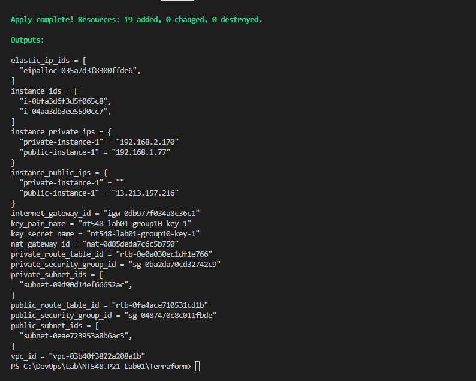
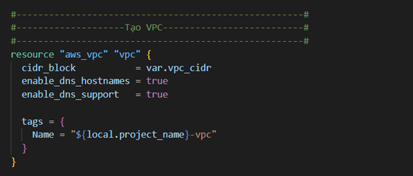
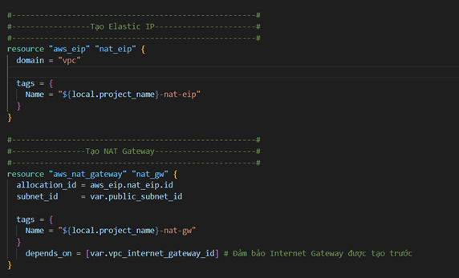
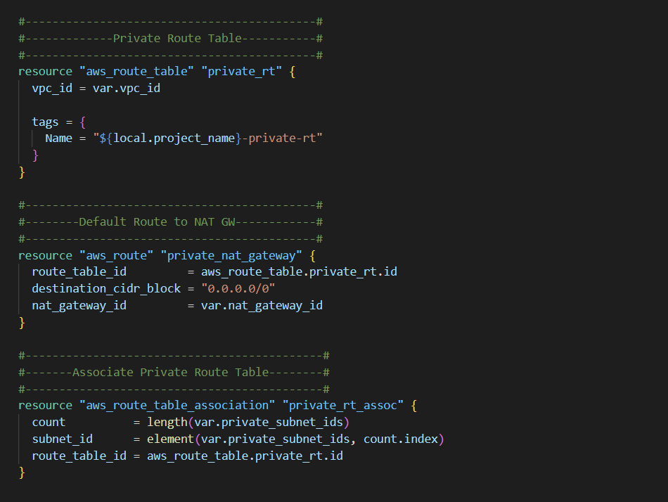
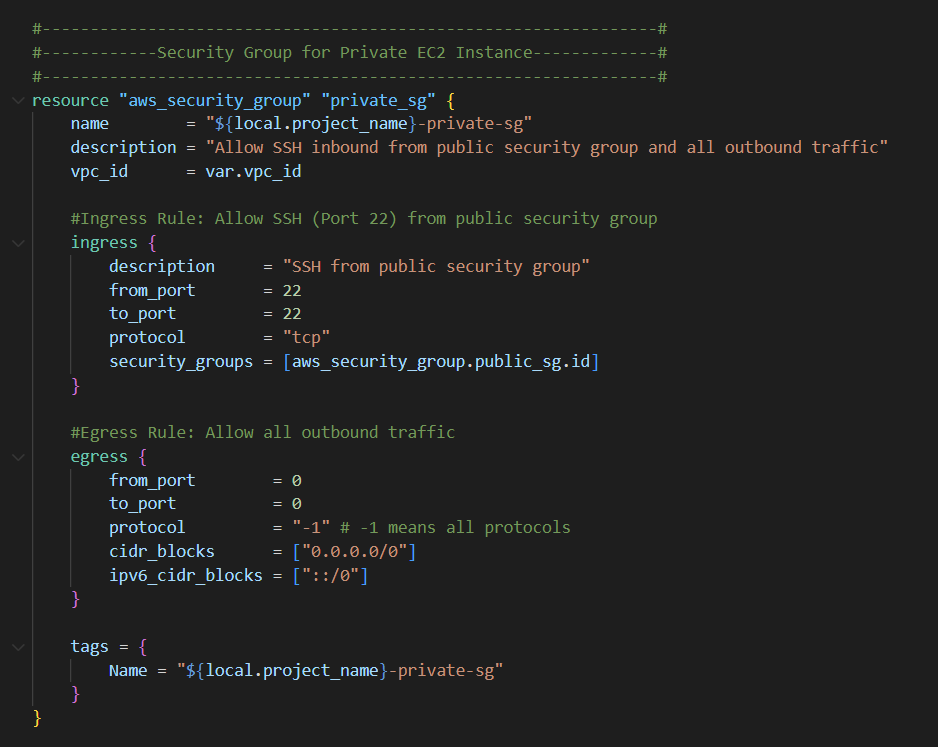
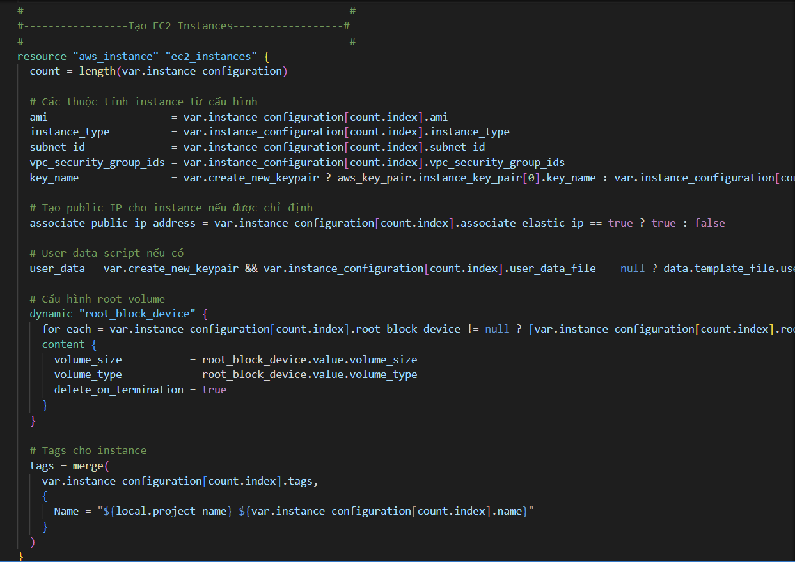
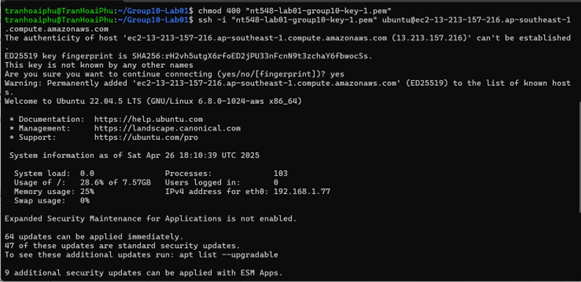
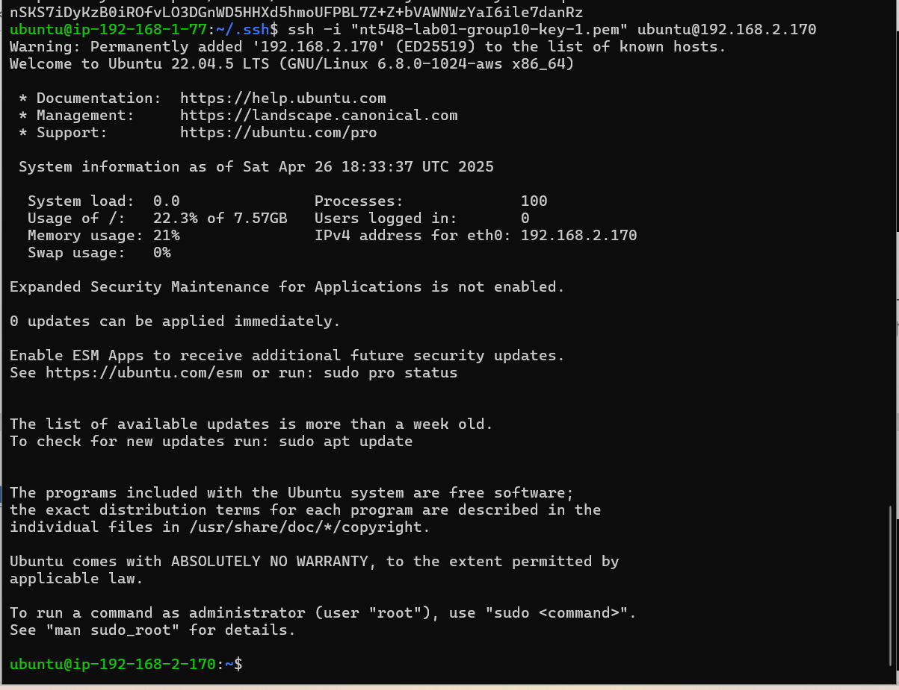

# Công nghệ DevOps và ứng dụng - NT548.P21

Đây là repository của bài thực hành môn **Công nghệ DevOps và ứng dụng - NT548.P21** của **nhóm 10**.

## Thành viên nhóm 10:

| STT | Họ và tên           | MSSV     |
|-----|---------------------|----------|
| 1   | Trần Hoài Phú       | 22521106 |
| 2   | Lê Ngọc Kiều Anh    | 22520047 |
| 3   | Tăng Dũng Cẩm       | 22520141 |
| 4   | Phạm Đức Anh        | 22520067 |

---

# Lab 01: Dùng Terraform và CloudFormation để quản lý và triển khai hạ tầng AWS
## 🧑‍💻 Contributors

- Trần Hoài Phú – Terraform modules
- Lê Ngọc Kiều Anh – Nested modules integration
- Tăng Dũng Cẩm – VPC, NAT Gateway, Route Tables
- Phạm Đức Anh – EC2 & Security Groups

## ✅ Self-Evaluation

- Time Spent: 2 Weeks  
- Team Coordination: Successful  
- Completion: 100% of Terraform requirements met  

# NT548.P21-Lab01 – Deploy AWS Infrastructure using Terraform

## 📌 Introduction

This repository demonstrates how to build a secure, modular, and scalable AWS network infrastructure using **Terraform**. It includes public/private subnets, NAT Gateway, security groups, and EC2 instances.

> 📁 GitHub repository link (required by assignment):  
> https://github.com/TranPio/NT548.P21-Lab01

## 📂 Project Structure

```
NT548.P21-Lab01/
├── Terraform/
│   ├── main.tf
│   ├── variables.tf
│   ├── outputs.tf
│   ├── modules/
│   │   ├── vpc/
│   │   ├── nat-gateway/
│   │   ├── route-tables/
│   │   ├── security-group/
│   │   └── ec2/
│   │       └── user-data.sh
├── Image/
│   ├── fig1.png  # Hình 1: Tạo resource VPC
│   ├── fig9.png  # Hình 9: Tạo resource Nat Gateway
│   ├── fig13.png # Hình 13: Tạo Private Route Table
│   ├── fig17.png # Hình 17: Tạo Security Group cho Private Instance
│   ├── fig22.png # Hình 22: Tạo resource EC2 Instance
│   ├── fig33.png # Hình 33: SSH thành công đến Public Instance
│   └── fig35.png # Hình 35: SSH từ Public đến Private Instance
```

## 🧰 Prerequisites

1. **AWS Credentials**  
   Install and configure the AWS CLI with IAM user credentials.

2. **SSH Key Pair**  
   Create via EC2 Console. Store the private key (`.pem`) securely.

3. **Secrets Manager**  
   Save your `.pem` as a plaintext secret in AWS Secrets Manager.  
   Script `user-data.sh` will automatically download and use this key at instance boot.

## 🚀 Deployment Instructions

1. **Clone the repository**

```bash
git clone https://github.com/TranPio/NT548.P21-Lab01.git
cd NT548.P21-Lab01/Terraform
```

2. **Configure variables** in `variables.tf`, especially:
   - `project_name`
   - `create_new_keypair`
   - `existing_key_name`

3. **Deploy infrastructure**

```bash
terraform init
terraform apply
```

> ✅ After apply, note the outputs: public/private IPs, instance IDs, etc.

## 🛰️ Steps to SSH to Instances

After applying all nested modules, you will see an output similar to the one below, which includes public and private IPs for each instance.

📸 **Hình 29** – Kết quả sau khi chạy `terraform apply` hiển thị output của các instance  


### Example Output (interpreted):

- `instance_private_ips`:  
  - `192.168.1.251` → Private IP of **Public Instance**  
  - `192.168.2.140` → Private IP of **Private Instance**

- `instance_public_ips`:  
  - `13.251.48.2` → Public IP of **Public Instance**

---

### 🔐 SSH to Public Instance

To connect to your public EC2 instance, follow these steps:

1. Locate your private key file (`.pem`)
2. Ensure proper permission:
```bash
chmod 400 <private-key-file>
```
3. SSH into the public instance:
```bash
ssh -i <private-key-file> <username>@<public-ip>
```

---

### 🔐 SSH to Private Instance (via Public)

Once you're inside the **public instance**, follow these steps:

1. Navigate to the SSH directory:
```bash
cd ~/.ssh
```
2. Run:
```bash
chmod 400 <private-key-file>
ssh -i <private-key-file> <username>@<private-ip>
```

> ✅ The file `user-data.sh` automatically retrieves your private key from AWS Secrets Manager and places it in `~/.ssh/` to simplify this process.

## 📸 Diagrams and Screenshots

## 📸 Diagrams and Screenshots

**Image 1** – Resource VPC creation using Terraform module  


**Image 2** – Create NAT Gateway with Elastic IP  


**Image 3** – Setup private route table routing via NAT Gateway  


**Image 4** – Security group: only allow SSH from Public SG  


**Image 5** – Public & Private EC2 instance deployment  


**Image 6** – Successfully SSH into Public Instance  


**Image 8** – SSH from Public Instance to Private using auto-downloaded key  

